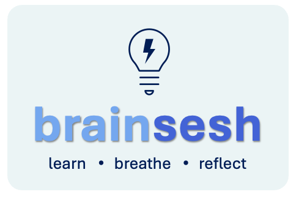

<!-- # brainsesh -->

Welcome to **brainsesh**, brain-session where thoughts collide, ideas spark, and neurons throw the best party in town! 

This is a space dedicated to **learning**, **growth**, **reflection**, and **inspiration**, where every brainsesh leaves you a little more enlightened and a lot more curious about the ongoing innovation.

[**Technical Reviews**](#technical-reviews) | [**Developer Toolkits**](#developer-toolkits) | [**Mindset Reset**](#mindset-reset)

   
  

 

This space is created to share technical perspectives, thought experiments, and learnings from contributor(s). Whether you're looking to discover insights about innovative breakthroughs, explore scientific concepts, or just seek to broaden perspectives brainsesh is your go-to space.

---

## Technical Reviews
Collection of articles and technical reviews that aim to make ideas in Artificial Intelligence, Machine Learning, Mathematics, and Applied Economics, accessible and fascinating.

1. <a href="./docs/dualformer/index.html" target="_blank">Learning to Think - Decoding Dualformer </a> : Bridging system 1 and system 2 thinking through transformers
2. <a href="./docs/software3/index.html" target="_blank">Beyond Programming - Changing Technology Landscape </a> : Navigating Software 1.0 → 2.0 → 3.0

---

## Developer Toolkits
Practical guides and insights into models, frameworks, and tools to build modern AI systems.

1. <a href="./docs/async_api/index.html" target="_blank">Building Robust AI Systems </a> : Engineer's Guide to Modern Architecture Design & Framework

---

## Mindset Reset
Articles and thoughts on resilience, courage, and what it means to show up — exploring ideas that inspire us to keep going and growing stronger.

1. <a href="./docs/arena/index.html" target="_blank">Step into the Arena </a> : Dare. Strive. Create. You belong in the Arena.
2. <a href="./docs/light/index.html" target="_blank">A Collection of Light </a> : Brighter thoughts for darker days.

---

## Disclaimer

The content expressed on this website, including but not limited to articles, tutorials, blog posts, technical experiments, comments, and other materials, are solely the personal opinions of the contributor(s) and do not represent or reflect the views, positions, technology, or policies of their respective employers, affiliated organizations, or the industries in which they work.

Any information provided should not be construed as professional advice or as an official statement from any organization with which contributors may be associated. All content is provided for informational purposes only. Readers should exercise their own judgment when considering the views and opinions presented here.

---

## Contact

If you have any questions and/or feedback, feel free to reach out at **[brainsesh@gmail.com](mailto:brainsesh@gmail.com)**.

---

  The goal is simple. Better than yesterday. 

